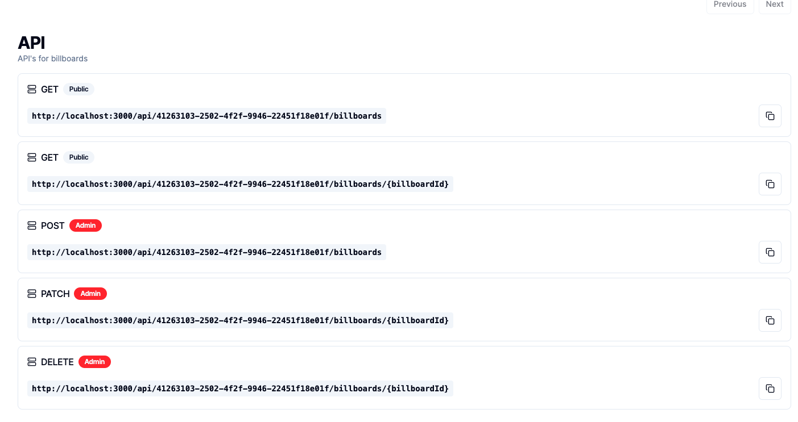

<div>
  <!-- Heading -->
  <section>
    <h1>
      <a href="https://ecommerce-admin-steez.vercel.app/" target="_blank" >
        E-commerce Admin
      </a>
    </h1>
    
    <h2>
      Manage multiple micro frontends with this toolkit.
    </h2>
  </section>
  <!-- Badges -->
  <section>
    <a href="https://github.com/steezplusplus/ecommerce-admin/stargazers" target="_blank" >
      
    </a>
    <a href="https://github.com/steezplusplus/ecommerce-admin/issues" target="_blank" >
      
    </a>
    <a href="/LICENSE" target="_blank" >
      
    </a>
    <a href="#">
      
    </a>
    <a href="#">
      
    </a>
  </section>
  <!-- Tech Stack -->
  <section>
    <h2>Built with</h2>
    <p>vercel - cloudinary - clerk - supabase - nextjs13 - typescript - tailwind</p>
  </section>
  <!-- Support -->
   <section>
    <h2>Support me!</h2>
    <a href="https://ko-fi.com/W7W5PB4J9" target="_blank"> 
       
    </a>
    <p>
      <i>Or leave a ⭐</i>
    </p>
  </section>

## Features

- Passwordless signup with Google social integration
- CRUD operations for creating a store, billboards, products, colors, categories, and more
- Upload the resources that your store will need
- Automatically generates API endpoints for your frontend to use
- Use Any frontend framework that you like!

## Setup

1. Clone this project

```shell
git clone ...
```

2. Install Packages

```shell
npm install
```

3. Generate your dotenv file. Follow the instructions in the file to get the env variables.

```shell
cp .env.example .env
```

4. Prepare prisma

```shell
npx prisma generate
npx prisma db push
```

5. Start the app

```shell
npm run dev
```

## View an exmaple frontend I've built here: [E-commerce Store](https://github.com/steezplusplus/ecommerce-store)

## Available commands

| command        | description                              |
| :------------- | :--------------------------------------- |
| `dev`          | Starts a development instance of the app |
| `build`        | Builds a production instance of the app  |
| `start`        | Starts a production instance of the app  |
| `lint`         | Runs ESLint                              |
| `lint:fix`     | Runs ESLint and fixes syntax             |
| `prettier`     | Runs Prettier                            |
| `prettier:fix` | Runs Prettier and fixes formatting       |
| `postinstall`  | Generates Primsa client                  |

## Entity Relationship Diagram


